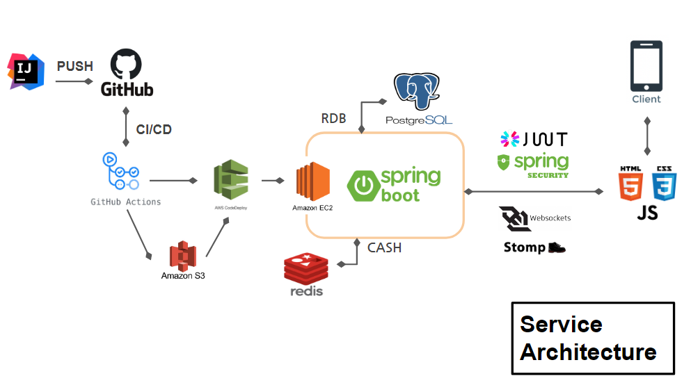
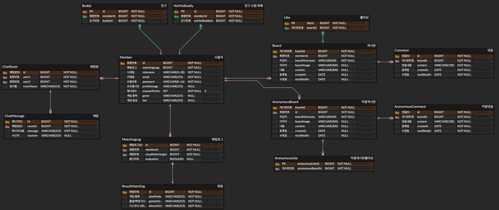

   
### 🎮 ㅈㄱㅃㄱ (즐겜빡겜)
###### 즐겜빡겜은 "게임 랜덤 매칭 서비스" 입니다 
---

**왜 만들게 되었나요** ❓
 - 

- 랜덤 매칭 서비스의 부재
- 사용자의 니즈에 맞춘 매칭 세분화
- 트롤방지 ... (악의성 플레이어 방지)

[🙋‍♂️ 소개 페이지 링크  Notion =:3](https://www.notion.so/6fecce0f474f440ab5e43dea66022df2)

## 🛠️ 사용기술 

### Data base

### Infra

### FrontEnd

### Tools & Collaboration

### 

## ❓ 기술적 의사 결정

CICD

🙅
Jenkins vs GithubActions

🙆

젠킨스의 러닝커브를 감당하기 어려웠고, 소규모 프로젝트인것을 감안하여 프로젝트의  원활한 동작을 목표로 하여 조금 더 쉽고 간편한 *깃헙액션 으로 채택하였습니다.

Front End

🙅 Github pages Vs Aws S3

깃헙페이지스는 url을 디폴트로 https 를 활성화 해주는데 
현재 백엔드에서 서버는 http이므로 믹스트 콘텐츠 에러를 발생하였습니다.
🙆

기존에 선택했던 S3배포를 그대로 유지하고,  다른 기능에 조금 더 집중하는 것을 선택 하였습니다.

Redis

🙅

매칭서비스가 유저의 매칭 신청과 취소 I/O 접근이 굉장히 빈번하게 일어나고 그에 따라 속도가 보장 되어야 했습니다.
또 ,실패 또는 취소시 데이터가 저장 되어 있지 않아야 해서 이러한 부분을 RDB로 감당하기엔 자원에 대한 비용을 생각하지 않을 수 없었습니다.마지막으론 다른 기능들과의 분리 였습니다. 댓글이나 게시글에 오류로 서버가 내려가는 경우 RDB와 현재 매칭중인 기록들이 남아 있어야 서버의 재구동시에도 데이터가 안전 할 수 있어야 했기 때문에 외부의 데이터 서버가 필요 했습니다.

🙆

레디스의 특징으로는 싱글스레드 동작 방식으로 데이터의 레이스컨디션을 해결하고 데이터 처리 속도가 초당 5 ~ 6만건 처리속도로 굉장히 빠른 속도를 보장합니다. 또한 외부에 서버를 두어 앞서 말씀드린 데이터의 안정성을 해결 할수 있었습니다. 
또 캐싱처리가 필요한 다른기능들에 확장이 용이 하여 채택하게 되었습니다 .

Websocket & Stomp

🙅

사용자의 요청이 없어도 실시간으로 응답을 받기 원했습니다.
또 채팅은 속도와 실시간성이 보장 되어야 했습니다. 

🙆

웹소켓과 스톰프 채택하여 채팅을 더욱 가볍고 빠르게 사용할 될 수 있게 구현을 해 보았습니다.
매칭서비스의 매칭 취소 및 이탈에 대해 
사용자의 세션을 확인하여 
레디스에 해당 유저를 대기열에서 실시간으로 삭제가 가능하게 구현 했습니다. 

### ERD

